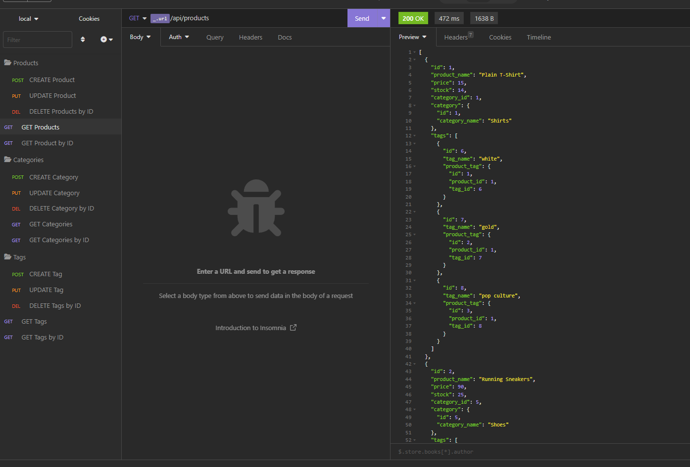
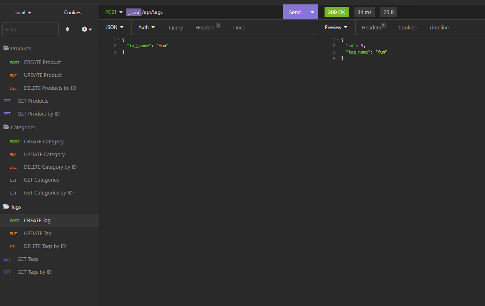

# marketMaven

by Ashlee Hufff

## Table of Contents
- [marketMaven](#marketmaven)
  - [Table of Contents](#table-of-contents)
  - [Description](#description)
  - [Installation](#installation)
  - [Usage](#usage)
  - [API Routes](#api-routes)
    - [Categories](#categories)
    - [Products](#products)
    - [Tags](#tags)
  - [Contribution](#contribution)
  - [License](#license)
  - [Questions](#questions)

## Description
This application is an Express.js API that connects to a MySQL database using the Sequelize package. It also uses the dotenv package to store sensitive data in environment variables.

With this application, you can create, read, update, and delete data for categories, products, and tags in an e-commerce database. You can test the API routes using Insomnia Core and get formatted JSON responses for GET requests.


## Installation
To install the application, you need to clone the repository and install the required packages. Follow the steps below:

1. Clone the repository:

```
git clone https://github.com/<your-username>/ecommerce-backend.git
```

2. Install the required packages:

```
npm install
```

3. Create a .env file in the root directory of the project and add the following:

```
DB_NAME='your_database_name'
DB_USER='your_mysql_username'
DB_PW='your_mysql_password'
```

4. Create the database and seed data:

```
npm run seed
```

## Usage

Walkthrough video: https://drive.google.com/file/d/1T56_NsUVUJjeCFIcWnxfER1LBcxEbF9m/view?usp=share_link

To start the application, run the following command:

```
npm start
```

This will start the server and sync the Sequelize models to the MySQL database. You can now test the API routes using Insomnia Core.

## API Routes
The following API routes are available:

### Categories
- GET /api/categories - Get all categories
- GET /api/categories/:id - Get a single category by id
- POST /api/categories - Create a new category
- PUT /api/categories/:id - Update a category by id
- DELETE /api/categories/:id - Delete a category by id



### Products
- GET /api/products - Get all products
- GET /api/products/:id - Get a single product by id
- POST /api/products - Create a new product
- PUT /api/products/:id - Update a product by id
- DELETE /api/products/:id - Delete a product by id



### Tags
- GET /api/tags - Get all tags
- GET /api/tags/:id - Get a single tag by id
- POST /api/tags - Create a new tag
- PUT /api/tags/:id - Update a tag by id
- DELETE /api/tags/:id - Delete a tag by id

## Contribution
If you find any bugs or want to make improvements to the application, feel free to fork the repository and create a pull request.

## License
This application is licensed under the MIT License.

## Questions
- Name - Ashlee Huff
- Email - huff.n.ashlee@gmail.com
- Github - https://github.com/ash12486/